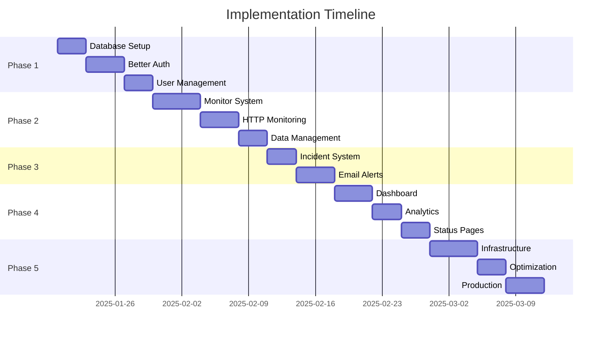

# Uptime Monitor Implementation Plan
## Better Auth + tRPC + Monitoring Features Integration

---

## 🎯 **Project Overview**

Transform the existing tRPC turborepo into a comprehensive uptime monitoring platform by integrating:
- **Better Auth** for modern authentication
- **Complete monitoring features** from the open source uptime monitor
- **Scalable architecture** with multi-region support
- **Real-time dashboard** and alerting system

---

## 📋 **Phase 1: Foundation & Authentication**
**Duration: 1-2 weeks | Priority: Critical**

### **Epic 1.1: Database Infrastructure Setup**

#### **User Story 1.1.1: Database Package Creation**
- **As a developer**, I want a shared database package so that all apps can use the same database client
- **Acceptance Criteria:**
  - [ ] Create `packages/database` workspace package
  - [ ] Configure Drizzle ORM with PostgreSQL connection
  - [ ] Set up database configuration and environment variables
  - [ ] Add package to turbo workspace dependencies

#### **User Story 1.1.2: Better Auth Schema Implementation**
- **As a system**, I need Better Auth compatible tables so that authentication works properly
- **Acceptance Criteria:**
  - [ ] Implement `user` table with Better Auth required fields
  - [ ] Create `session` table for session management
  - [ ] Add `account` table for OAuth providers
  - [ ] Implement `verification` table for email verification
  - [ ] Add proper relationships and indexes

#### **User Story 1.1.3: Database Client Setup**
- **As an application**, I need a shared database client so that I can perform database operations
- **Acceptance Criteria:**
  - [ ] Export configured Drizzle client from database package
  - [ ] Set up connection pooling and error handling
  - [ ] Add migration scripts and database seeding
  - [ ] Configure development and production environments

### **Epic 1.2: Better Auth Integration**

#### **User Story 1.2.1: Authentication Provider Setup**
- **As a user**, I want to sign up and log in so that I can access the monitoring platform
- **Acceptance Criteria:**
  - [ ] Install and configure Better Auth in API package
  - [ ] Set up email/password authentication
  - [ ] Configure OAuth providers (Google, GitHub)
  - [ ] Implement session management and cookies

#### **User Story 1.2.2: tRPC Authentication Middleware**
- **As a developer**, I want authenticated tRPC procedures so that user data is protected
- **Acceptance Criteria:**
  - [ ] Create authentication middleware for tRPC
  - [ ] Add user context to tRPC procedures
  - [ ] Implement protected procedure wrapper
  - [ ] Add proper error handling for unauthorized access

#### **User Story 1.2.3: Frontend Authentication Integration**
- **As a user**, I want a seamless login experience so that I can easily access my account
- **Acceptance Criteria:**
  - [ ] Create Better Auth client configuration
  - [ ] Implement login/signup pages
  - [ ] Add authentication state management
  - [ ] Create protected route components

### **Epic 1.3: User Management System**

#### **User Story 1.3.1: User Profile Management**
- **As a user**, I want to manage my profile so that I can update my account information
- **Acceptance Criteria:**
  - [ ] Implement user profile tRPC procedures
  - [ ] Create profile management UI components
  - [ ] Add email verification workflow
  - [ ] Implement password change functionality

#### **User Story 1.3.2: Subscription Plan System**
- **As a user**, I want different subscription tiers so that I can choose the right plan for my needs
- **Acceptance Criteria:**
  - [ ] Add subscription fields to user schema
  - [ ] Implement plan limits (Basic: 2 monitors, Premium: 10 monitors, Enterprise: unlimited)
  - [ ] Create subscription management tRPC procedures
  - [ ] Add plan upgrade/downgrade functionality

---

## 📊 **Phase 2: Core Monitoring Infrastructure**
**Duration: 2-3 weeks | Priority: High**

### **Epic 2.1: Monitor Management System**

#### **User Story 2.1.1: Monitor Database Schema**
- **As a system**, I need monitor data storage so that I can track website uptime
- **Acceptance Criteria:**
  - [ ] Create `monitors` table with URL, interval, timeout, regions
  - [ ] Implement `monitor_results` table for storing check results
  - [ ] Add `monitor_logs` table for debugging information
  - [ ] Set up proper indexes for performance

#### **User Story 2.1.2: Monitor CRUD Operations**
- **As a user**, I want to add and manage monitors so that I can track my websites
- **Acceptance Criteria:**
  - [ ] Implement create monitor tRPC procedure with validation
  - [ ] Add update monitor functionality
  - [ ] Implement delete (soft delete) monitor
  - [ ] Create list monitors with filtering and pagination

#### **User Story 2.1.3: Monitor Configuration**
- **As a user**, I want to configure monitoring settings so that checks work for my specific needs
- **Acceptance Criteria:**
  - [ ] Add monitor interval configuration (1, 3, 5, 10, 15, 30 minutes)
  - [ ] Implement timeout settings
  - [ ] Add expected status code configuration
  - [ ] Set up multi-region monitoring options

### **Epic 2.2: HTTP Monitoring Engine**

#### **User Story 2.2.1: HTTP Check Service**
- **As a system**, I need to perform HTTP checks so that I can monitor website uptime
- **Acceptance Criteria:**
  - [ ] Create HTTP monitoring service
  - [ ] Implement GET/POST/PUT/DELETE method support
  - [ ] Add response time measurement
  - [ ] Include status code validation

#### **User Story 2.2.2: Monitoring Scheduler**
- **As a system**, I need to schedule monitoring checks so that websites are monitored continuously
- **Acceptance Criteria:**
  - [ ] Implement cron-based monitoring scheduler
  - [ ] Create job queue for monitoring tasks
  - [ ] Add monitor due-for-check logic
  - [ ] Implement concurrent monitoring with rate limiting

#### **User Story 2.2.3: Multi-Region Support**
- **As a user**, I want monitoring from multiple regions so that I get global uptime visibility
- **Acceptance Criteria:**
  - [ ] Configure monitoring from US East, EU West, Asia Pacific
  - [ ] Implement region-specific result storage
  - [ ] Add regional performance comparison
  - [ ] Set up region failover logic

### **Epic 2.3: Data Management & Storage**

#### **User Story 2.3.1: Result Storage System**
- **As a system**, I need to store monitoring results so that I can provide historical data
- **Acceptance Criteria:**
  - [ ] Store monitor results with timestamp, region, response time
  - [ ] Implement efficient data insertion with batching
  - [ ] Add result aggregation for dashboard analytics
  - [ ] Set up data compression for long-term storage

#### **User Story 2.3.2: Data Retention & Cleanup**
- **As a system**, I need data cleanup so that the database doesn't grow infinitely
- **Acceptance Criteria:**
  - [ ] Implement automatic log cleanup (7+ days old)
  - [ ] Add configurable data retention policies
  - [ ] Create database maintenance scripts
  - [ ] Set up monitoring result archival

---

## 🚨 **Phase 3: Alerting & Incident Management**
**Duration: 1-2 weeks | Priority: High**

### **Epic 3.1: Incident Detection & Management**

#### **User Story 3.1.1: Automatic Incident Creation**
- **As a system**, I need to automatically detect downtime so that users are notified of issues
- **Acceptance Criteria:**
  - [ ] Create incidents when monitors fail
  - [ ] Implement incident resolution when monitors recover
  - [ ] Add incident timeline and status tracking
  - [ ] Set up incident severity levels

#### **User Story 3.1.2: Incident Dashboard**
- **As a user**, I want to see current incidents so that I know what's down
- **Acceptance Criteria:**
  - [ ] Create incident list UI with real-time updates
  - [ ] Add incident details and timeline view
  - [ ] Implement manual incident acknowledgment
  - [ ] Show incident duration and impact

### **Epic 3.2: Email Alerting System**

#### **User Story 3.2.1: Email Notification Service**
- **As a user**, I want email alerts when my monitors go down so that I can respond quickly
- **Acceptance Criteria:**
  - [ ] Set up email service with SMTP configuration
  - [ ] Create email templates for downtime alerts
  - [ ] Implement email delivery with retry logic
  - [ ] Add email preference management

#### **User Story 3.2.2: Alert Recipients Management**
- **As a user**, I want to add team members to alerts so that my team is notified
- **Acceptance Criteria:**
  - [ ] Create alert recipients table and CRUD operations
  - [ ] Implement per-monitor recipient configuration
  - [ ] Add recipient verification workflow
  - [ ] Set up recipient limits per subscription plan

#### **User Story 3.2.3: Notification Throttling**
- **As a user**, I don't want spam alerts so that I'm not overwhelmed with notifications
- **Acceptance Criteria:**
  - [ ] Implement 1-hour minimum between duplicate alerts
  - [ ] Add escalation rules for continued downtime
  - [ ] Create quiet hours configuration
  - [ ] Set up alert summary notifications

---

## 📈 **Phase 4: Dashboard & Analytics**
**Duration: 1-2 weeks | Priority: Medium**

### **Epic 4.1: Real-time Monitoring Dashboard**

#### **User Story 4.1.1: Monitor Status Overview**
- **As a user**, I want to see all my monitors at a glance so that I know overall system health
- **Acceptance Criteria:**
  - [ ] Create monitor cards with status indicators (up/down/checking)
  - [ ] Show current response times and uptime percentages
  - [ ] Implement real-time status updates
  - [ ] Add monitor search and filtering

#### **User Story 4.1.2: Live Data Updates**
- **As a user**, I want live dashboard updates so that I see current status without refreshing
- **Acceptance Criteria:**
  - [ ] Implement WebSocket or Server-Sent Events for real-time updates
  - [ ] Add auto-refresh with configurable intervals
  - [ ] Show last check time and next check schedule
  - [ ] Display connection status and loading states

### **Epic 4.2: Analytics & Reporting**

#### **User Story 4.2.1: Uptime Analytics**
- **As a user**, I want to see uptime trends so that I can analyze monitor performance
- **Acceptance Criteria:**
  - [ ] Calculate and display uptime percentages (24h, 7d, 30d, 90d)
  - [ ] Create uptime trend charts and graphs
  - [ ] Show average response times by region
  - [ ] Implement downtime incident summaries

#### **User Story 4.2.2: Performance Metrics**
- **As a user**, I want detailed performance data so that I can optimize my services
- **Acceptance Criteria:**
  - [ ] Display response time charts and histograms
  - [ ] Show regional performance comparisons
  - [ ] Add performance alerting for slow responses
  - [ ] Create performance improvement recommendations

### **Epic 4.3: Public Status Pages**

#### **User Story 4.3.1: Public Status Page Creation**
- **As a user**, I want public status pages so that my customers can see service status
- **Acceptance Criteria:**
  - [ ] Generate unique public URLs for status pages
  - [ ] Create customizable status page layouts
  - [ ] Show current status and recent incidents
  - [ ] Implement historical uptime data

#### **User Story 4.3.2: Status Page Customization**
- **As a user**, I want to customize my status page so that it matches my brand
- **Acceptance Criteria:**
  - [ ] Add custom branding and logo options
  - [ ] Implement custom domain support
  - [ ] Create theme and color customization
  - [ ] Add custom messaging and maintenance notices

---

## 🚀 **Phase 5: Advanced Features & Production**
**Duration: 2-3 weeks | Priority: Medium**

### **Epic 5.1: Scalable Infrastructure**

#### **User Story 5.1.1: Distributed Monitoring**
- **As a system**, I need scalable monitoring so that I can handle thousands of monitors
- **Acceptance Criteria:**
  - [ ] Set up AWS SQS queues for job distribution
  - [ ] Implement worker processes for monitoring execution
  - [ ] Add horizontal scaling capabilities
  - [ ] Configure load balancing for workers

#### **User Story 5.1.2: AWS Lambda Integration**
- **As a system**, I want serverless monitoring so that I can reduce infrastructure costs
- **Acceptance Criteria:**
  - [ ] Create AWS Lambda functions for monitoring
  - [ ] Set up Lambda deployment and configuration
  - [ ] Implement Lambda-based multi-region monitoring
  - [ ] Add Lambda monitoring and alerting

### **Epic 5.2: Performance & Optimization**

#### **User Story 5.2.1: Database Optimization**
- **As a system**, I need optimized queries so that the dashboard loads quickly
- **Acceptance Criteria:**
  - [ ] Add database indexes for frequently queried data
  - [ ] Implement query optimization and caching
  - [ ] Set up database connection pooling
  - [ ] Add database performance monitoring

#### **User Story 5.2.2: API Performance**
- **As a user**, I want fast API responses so that the dashboard is responsive
- **Acceptance Criteria:**
  - [ ] Implement tRPC request batching
  - [ ] Add response caching with TTL
  - [ ] Set up API rate limiting
  - [ ] Add performance monitoring and logging

### **Epic 5.3: Production Readiness**

#### **User Story 5.3.1: Security & Compliance**
- **As a business**, I need secure authentication so that user data is protected
- **Acceptance Criteria:**
  - [ ] Implement proper HTTPS and security headers
  - [ ] Add input validation and sanitization
  - [ ] Set up audit logging for sensitive operations
  - [ ] Implement GDPR compliance features

#### **User Story 5.3.2: Monitoring & Observability**
- **As a developer**, I need application monitoring so that I can maintain system health
- **Acceptance Criteria:**
  - [ ] Set up application performance monitoring (APM)
  - [ ] Add error tracking and alerting
  - [ ] Implement health checks and status endpoints
  - [ ] Create operational dashboards and alerts

---

## 🎯 **Success Criteria & Metrics**

### **Phase 1 Success Metrics:**
- [ ] Better Auth authentication working with email/password and OAuth
- [ ] User registration, login, and profile management functional
- [ ] Database package properly integrated with all apps
- [ ] Subscription plans implemented with proper limits

### **Phase 2 Success Metrics:**
- [ ] Monitor CRUD operations working via tRPC
- [ ] HTTP monitoring service performing actual checks
- [ ] Multi-region monitoring operational
- [ ] Monitor results being stored and retrieved correctly

### **Phase 3 Success Metrics:**
- [ ] Automatic incident creation and resolution working
- [ ] Email alerts being sent for downtime
- [ ] Alert recipients management functional
- [ ] Notification throttling preventing spam

### **Phase 4 Success Metrics:**
- [ ] Real-time dashboard showing live monitor status
- [ ] Uptime analytics and trends displaying correctly
- [ ] Public status pages accessible and updating
- [ ] Performance metrics showing response times

### **Phase 5 Success Metrics:**
- [ ] Distributed monitoring infrastructure deployed
- [ ] System handling 100+ monitors efficiently
- [ ] Production-ready security and monitoring in place
- [ ] Performance optimizations showing measurable improvements

---

## 🛠 **Technical Stack Decisions**

- **Database**: Drizzle ORM + PostgreSQL (Better Auth compatible)
- **Authentication**: Better Auth (modern, type-safe)
- **API**: tRPC v11 (end-to-end type safety)
- **Frontend**: Next.js 15 + TanStack Query (real-time updates)
- **Monitoring**: Custom HTTP service (no external dependencies)
- **Queuing**: AWS SQS (distributed monitoring)
- **Email**: Nodemailer or similar (alert notifications)
- **Deployment**: Vercel/AWS (scalable infrastructure)

---

## 📅 **Timeline & Dependencies**

**Total Estimated Duration: 6-8 weeks**

---

*This plan maintains the modern architecture of the existing tRPC setup while integrating comprehensive monitoring features, ensuring type safety and excellent developer experience throughout the implementation.*